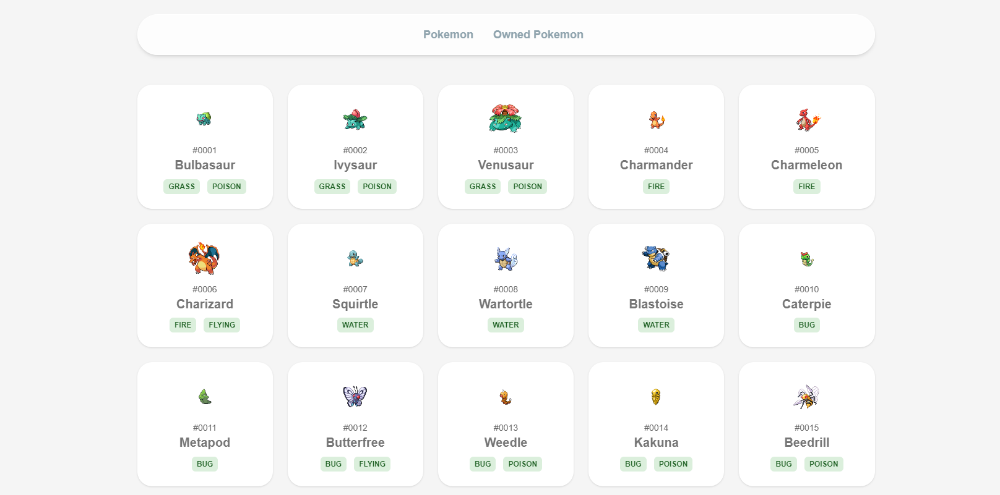

## Pokecatch
A simple pokemon website that allows user to catch & release their pokemons (only front-end)

## Project
This is a [Next.js](https://nextjs.org/) project bootstrapped with [`create-next-app`](https://github.com/vercel/next.js/tree/canary/packages/create-next-app).

## How to run
- Install the packages:
```bash
npm install
```

- Run the development server:
```bash
npm run dev
```

## Result

